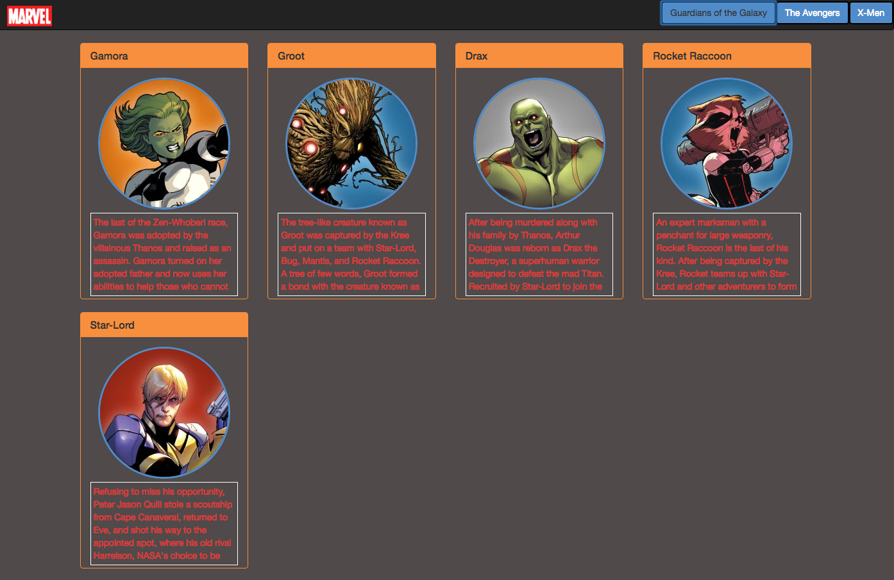

# ModernJS Mastery Exercise | QUIZ

## Assignment Parameters:
* RUN GRUNT ON PROJECT | USE ES6 SYNTAX | IMPLEMENT AJAX PROMISE STRUCTURE FOR ALL CALLS

#### On Page load
* STYLING MUST USE BOOTSTRAP
	* Should have marvel logo for brand
	* Should be a button for each team in the teams.json file
* There should be a large Marvel logo

#### EXAMPLE SCREENSHOT TO MIMIC STYLING:
Screenshot:


#### On click of a button in the navbar
* The large Marvel logo should go away (use a jQuery method for this)
* The click event should call a function called dataGetter that has a Promise.all
* The Promise.all should resolve 3 functions that get the data from the json files
* dataGetter should pass a SINGLE array to the writeDom function
* The writeDom function should write everything to the DOM

#### Data requirements
* DO NOT CHANGE JSON FILES
* If there is no description for a character (ie description is "") your code should change the description as follows:
	* A female character with no description should get a description of "abcde fghij klmno pqrst uvwxy z"
	* A male character with no description should get a description of "1234567890"

#### Style requirements
* Each character should be displayed in a bootstrap panel
* Each character's image should be a circle and have a border color of:
	* Blue if the character is Male
	* Pink if the character is Female
* There should be 4 panels in each row
* Each row should have a bootstrap row class


#### END BONUS FEATURE:
* Dynamically add the team button in the navbar

#### FINAL SCREENSHOT OF BUILD -> on button click:


#### HOW TO RUN
```
1. git clone https://github.com/nss-evening-cohort-05/modernjs-mastery-exercise-anessao
2. modernjs-mastery-exercise-anessao
3. npm install http-server -g
4. http-server -p 8080

1. cd into lib directory
1. bower init
1. bower install jquery --save
1. bower install bootstrap --save
2. npm init
3. npm install

```
#### TECHNOLOGIES USED
- JavaScript | ES6
- HTML
- CSS
- JSON
- BOOTSTRAP
- JQuery


